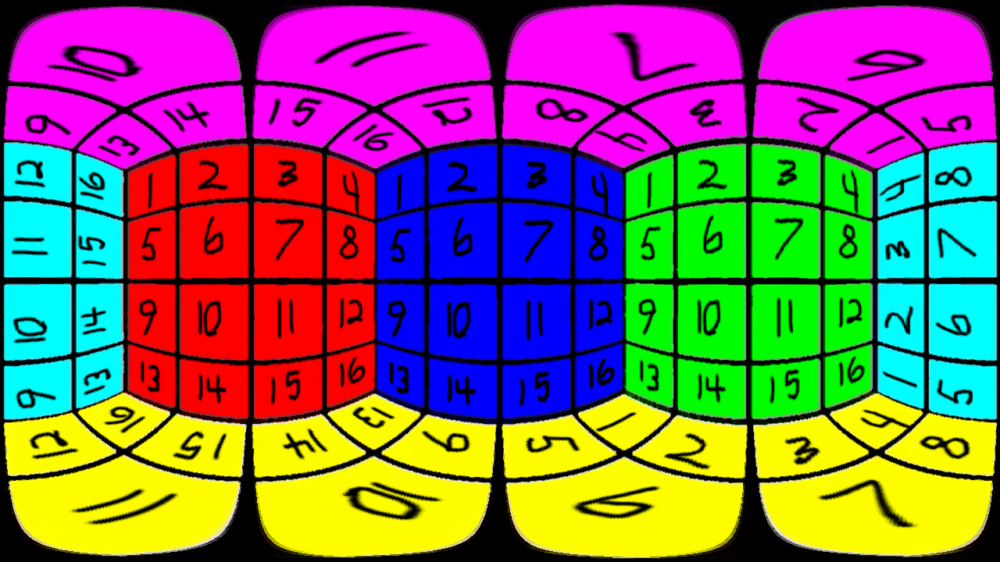

# Converting YouTube's VR Video Format to Equirectangular Projections

## Why make something like this?
I run Manjaro as my daily driver. I also have a VR headset (HTC Vive). Currently,
there is little to no support for webVR on GNU/Linux. I would like to be able to
enjoy the full VR experience of the large library of VR 360 videos on YouTube.

## How to run
Currently, the program only takes in a file named "input.png" in the current directory.
This will be updated later. I also plan on changing this from processing images to
processing videos. Once your desired picture has replaced "input.png," run ```python main.py```.

## Example
Input would look something like this:


When run through ```main.py```, it should result in something like this:

